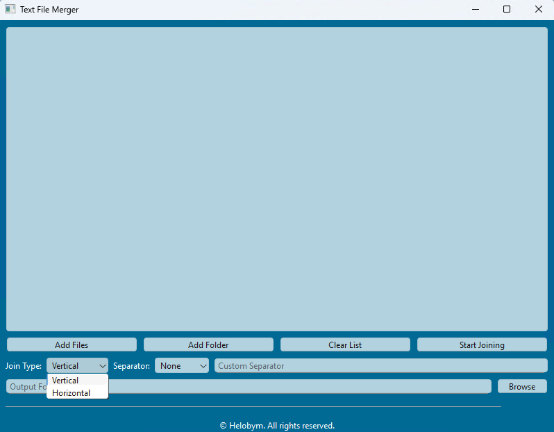
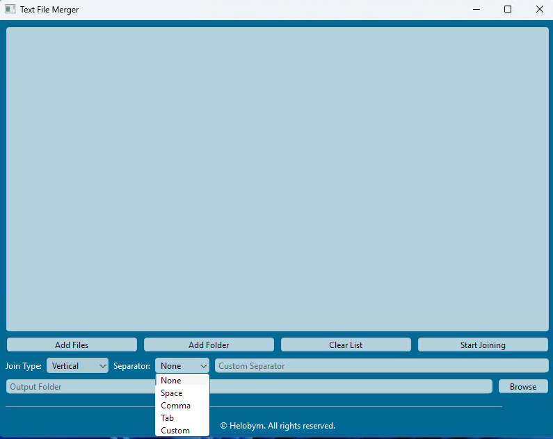

Text File Merger is a professional utility designed to combine multiple text files with precision and ease. This modern, ocean-blue interface application allows users to merge files vertically or horizontally with customizable separators. With support for both individual file and folder selection, it streamlines the process of combining text content while maintaining data integrity.

